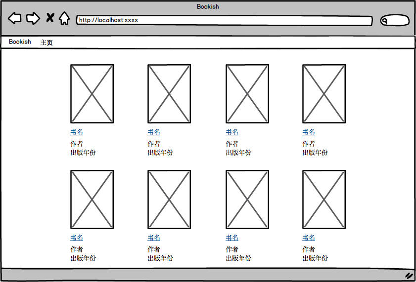
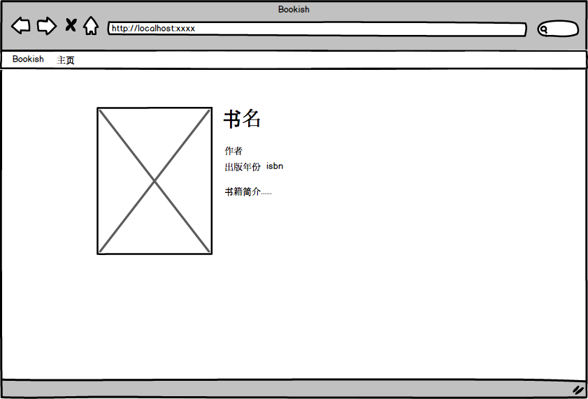

### #004 作为bookish用户，我希望能够看到书籍详情

##### Mockup

##### 需求
1. 当用户点击主页书籍列表中的书名时，页面跳转到书籍详情页面
2. 书籍详情页面左侧显示书籍封面图片
3. 书籍详情页面右侧，从上到下，依次显示书名、作者、出版年份 isbn、书籍简介
4. 若某书籍的isbn多于一个，则显示最后一个
5. 书籍信息，请见[books.json](books/books.json)
6. 书籍封面图片，请见[book actuals](books/images/actuals)
