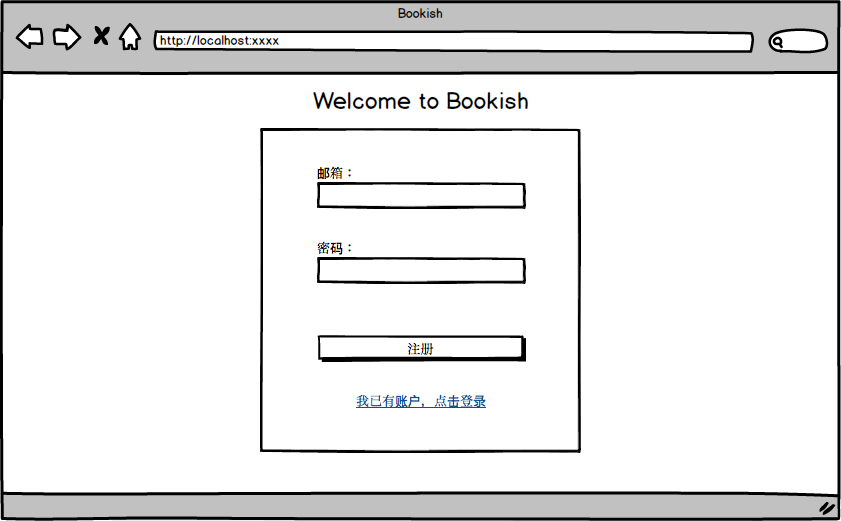
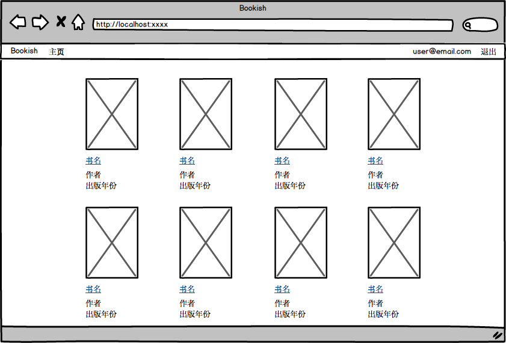

### #006 作为bookish用户，我希望可以注册账户

##### Mockup
   

##### 需求
- 访问bookish页面会打开注册页面
- 用户可以输入邮箱和密码
  - 邮箱不能为空，需符合邮箱命名规则，不能重复
  - 密码不能为空，不能保存明文
- 当用户点击“注册”按钮
  - 若邮箱重复需提示消息
  - 注册成功后，进入图书列表页面，右上角会显示用户的邮箱和“退出”链接
  - session保存在cookie里
  - session过期时间一周
- 下面有指向登录页面的链接，暂不实现跳转
